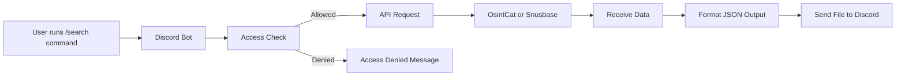

<div align="center">

# OSINT Tool
### Discord OSINT Search Bot • 2026


</div>

---

# osint-tool

leaked this only cuz the guy who made it made fun of me for no reason sooooooooo

---

## Overview

**osint-tool** is a lightweight Discord bot that allows users to perform **OSINT searches and breach database lookups** directly from Discord.

The bot integrates with external intelligence APIs and returns results as **structured JSON files** for easier viewing and analysis.

Supported APIs:

- **OsintCat**
- **Snusbase**

This repository is shared for **transparency and research purposes**.

---

## Features

- Discord **slash commands**
- **Whitelist / blacklist access control**
- **License key system**
- JSON formatted search results
- Snusbase **hash lookup**
- Database statistics command
- API query logging
- Easy configuration

---

## Animated API Flow

<div align="center">



</div>

---

## Commands

| Command | Description |
|-------|-------------|
| `/search` | Search via OsintCat API |
| `/snus` | Query Snusbase breach databases |
| `/crackhash` | Lookup hash using Snusbase |
| `/snusstats` | View Snusbase database statistics |
| `/redeem` | Redeem an access key |

### Owner Commands

| Command | Description |
|-------|-------------|
| `/whitelist_add` | Add user to whitelist |
| `/whitelist_remove` | Remove whitelist access |
| `/blacklist_add` | Blacklist a user |
| `/blacklist_remove` | Remove blacklist |

---

## Configuration

Before running the bot you must configure the following values in the script:

```python
OSINTCAT_KEY = ""
SNUSBASE_KEY = ""
BOT_TOKEN = ""
OWNER_ID = 1234567890
```

The bot will automatically generate:

```
whitelist.json
blacklist.json
licenses.json
```

These files store access and licensing information.

---

## Installation

### Requirements

- Python **3.9+**

Install dependencies:

```
pip install discord.py aiohttp
```

Run the bot:

```
python bot.py
```

---

## Security Notice

This project interacts with **third-party OSINT services**.  
Users are responsible for following the **terms of service and legal requirements** of those services.

The code itself contains **no proprietary or advanced techniques**.

---

## Disclaimer

This repository is provided **for educational and research purposes only**.

The maintainers are **not responsible for misuse** of this software or violations of third-party platform policies.

---

<div align="center">

If you don't understand how to configure API keys or run a Discord bot,  
this project probably isn't for you.

</div>
